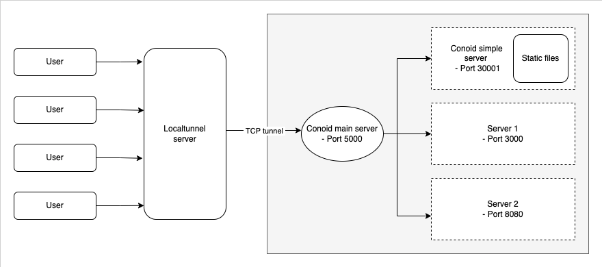

# CONOID

[](https://github.com/DeeStarks/conoid/actions/workflows/release.yml)
[](https://opensource.org/licenses/MIT)
[](https://github.com/deestarks/conoid/releases/latest)


---

Conoid is a TCP tunneling tool that uses [localtunnel](http://localtunnel.me/) to bypass a firewall or NAT and expose your local development server to the internet, as well as a simple HTTP server that can be used to serve static files.

While you can expose as many local servers as you want, conoid connects to the [localtunnel](http://localtunnel.me/) server only on a single port - **5000**, and directs traffic to your servers based on a mapping created while making the initail connections.

## Architecture



## Installation
### Homebrew
**Tap**
```
brew tap deestarks/conoid
```

**Install**
```
brew install conoid
```

**Start**
```
brew services start conoid
```

> Confirm conoid is running by going to http://127.0.0.1:5000 on your browser. You should see a welcome page.

## Usage

### List services
- Running services
```
conoid ps
```

- All services
```
conoid ps -a
```

### Expose a local server
```
conoid add \
    --name <your_app_name> --type server \
    --listener <your_server_address> --tunnel
```

E.g.
```
conoid add \
    --name my_app --type server \
    --listener <your_server_address> --tunnel
```

### Serving static files
```
conoid add \
    --name <your_app_name> --type static \
    --directory <document_directory>
```

or add the `--tunnel` flag to expose to the internet


Use the help flag `conoid [command] --help` or `-h` for more commands.
